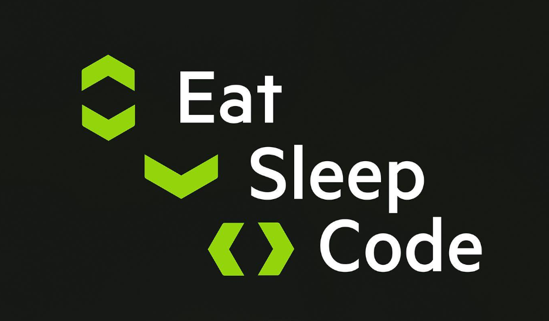

# Hello Universe!💫 I'm ER. Aleena 👩🏻‍🎓, a passionate Software Engineer 👩🏼‍💻 
🌟 On a journey of continuous learning, seeking entry-level opportunities in Data Science and AI  
🚀 Exploring the world of AI and Data Science  
💡 Excited to collaborate on AI, ML, and Data Science initiatives  

# 💻 Tech Stack:
                                           

<picture>
  <source media="(prefers-color-scheme: dark)" srcset="https://raw.githubusercontent.com/tobiasmeyhoefer/tobiasmeyhoefer/output/github-snake-dark.svg" />
  <source media="(prefers-color-scheme: light)" srcset="https://raw.githubusercontent.com/tobiasmeyhoefer/tobiasmeyhoefer/output/github-snake.svg" />
  
</picture>
